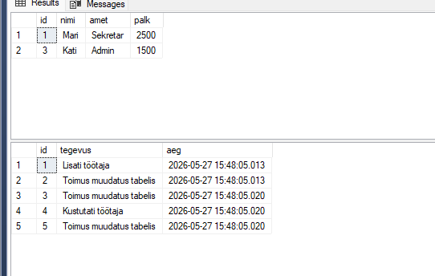
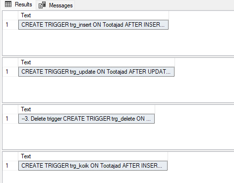
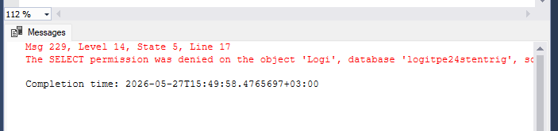

# Triggerid ülesanne

## Tabelite loomine

```sql
create database logitpe24stentrig
use logitpe24stentrig

--tabelid
CREATE TABLE Tootajad(
    id INT PRIMARY KEY IDENTITY(1,1),
    nimi VARCHAR(50),
    amet VARCHAR(50),
    palk INT
);

CREATE TABLE Logi(
    id INT PRIMARY KEY IDENTITY(1,1),
    tegevus VARCHAR(100),
    aeg DATETIME
);

select * from Tootajad
select * from Logi

--lisan andmed tabelisse
INSERT INTO Tootajad (nimi, amet, palk)
VALUES
('Mari', 'Sekretar', 1200),
('Jaan', 'IT', 2000);
```

## Tabelid ja andmed


## 3 triggerit

```sql
--1. Insert trigger
CREATE TRIGGER trg_insert
ON Tootajad
AFTER INSERT
AS
BEGIN
    INSERT INTO Logi(tegevus, aeg)
    VALUES ('Lisati töötaja', GETDATE())
END;

--2. Update trigger
CREATE TRIGGER trg_update
ON Tootajad
AFTER UPDATE
AS
BEGIN
    INSERT INTO Logi(tegevus, aeg)
    VALUES ('Muudeti töötaja andmeid', GETDATE())
END;

--3. Delete trigger
CREATE TRIGGER trg_delete
ON Tootajad
AFTER DELETE
AS
BEGIN
    INSERT INTO Logi(tegevus, aeg)
    VALUES ('Kustutati töötaja', GETDATE())
END;

--keelab insert ja delete triggerid
DISABLE TRIGGER trg_insert ON Tootajad;
DISABLE TRIGGER trg_delete ON Tootajad;

--Ühine trigger kõigile
CREATE TRIGGER trg_koik
ON Tootajad
AFTER INSERT, UPDATE, DELETE
AS
BEGIN
    INSERT INTO Logi(tegevus, aeg)
    VALUES ('Toimus muudatus tabelis', GETDATE())
END;
```

## Triggerite testimine

```sql
INSERT INTO Tootajad (nimi, amet, palk) VALUES ('Kati', 'Admin', 1500);
UPDATE Tootajad SET palk = 2500 WHERE id = 1;
DELETE FROM Tootajad WHERE id = 2;
select * from Logi
```

## EXEC sp_helptext triggerid

```sql
EXEC sp_helptext 'trg_insert';
EXEC sp_helptext 'trg_update';
EXEC sp_helptext 'trg_delete';
EXEC sp_helptext 'trg_koik';
```



## Sekretäri õigused

```sql
CREATE LOGIN sekretarSten
WITH PASSWORD = 'Andmebaasid143!4#PikEmParo0L';

CREATE USER sekretarSten FOR LOGIN sekretarSten;

GRANT SELECT, INSERT, DELETE ON Tootajad TO sekretarSten;
```

## Sekretär ei näe Logi tabelit

