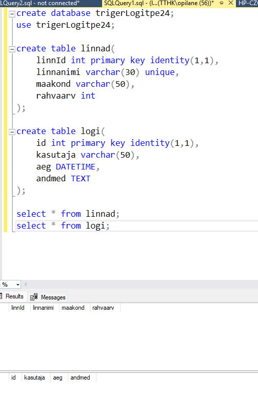
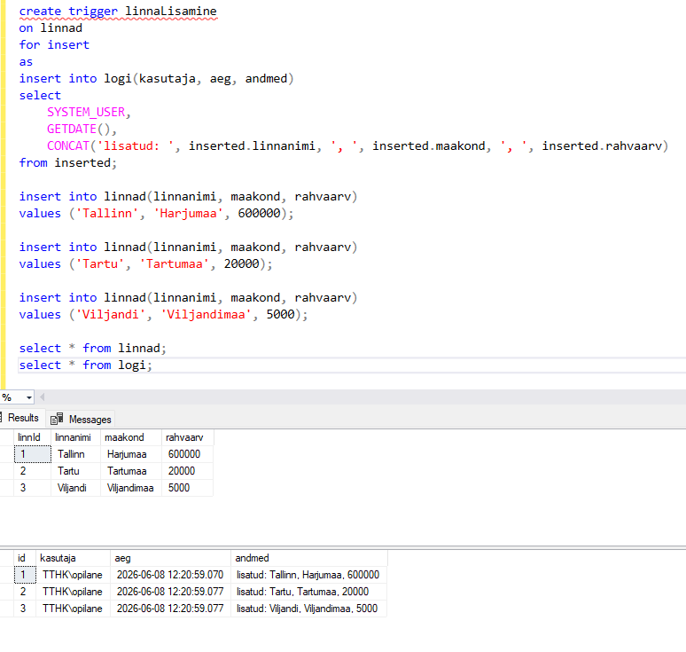
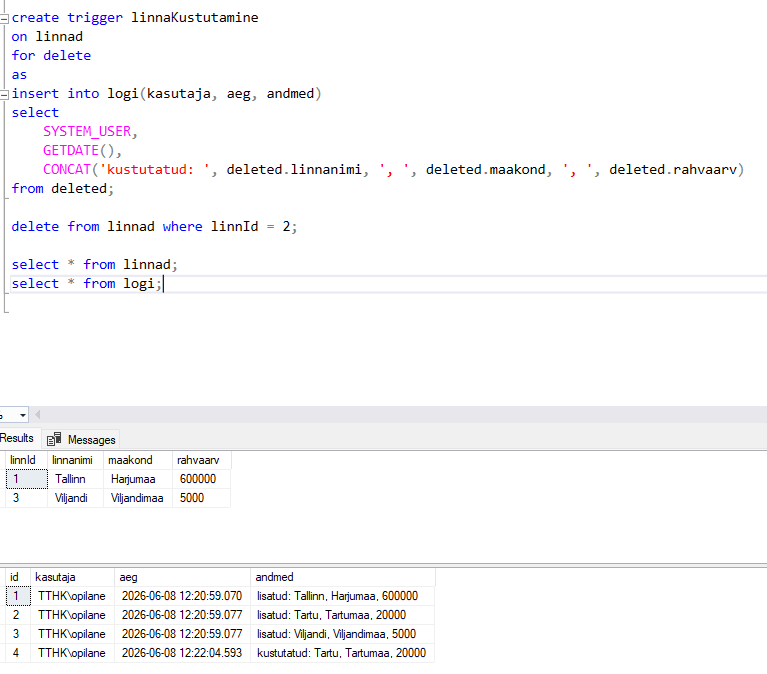
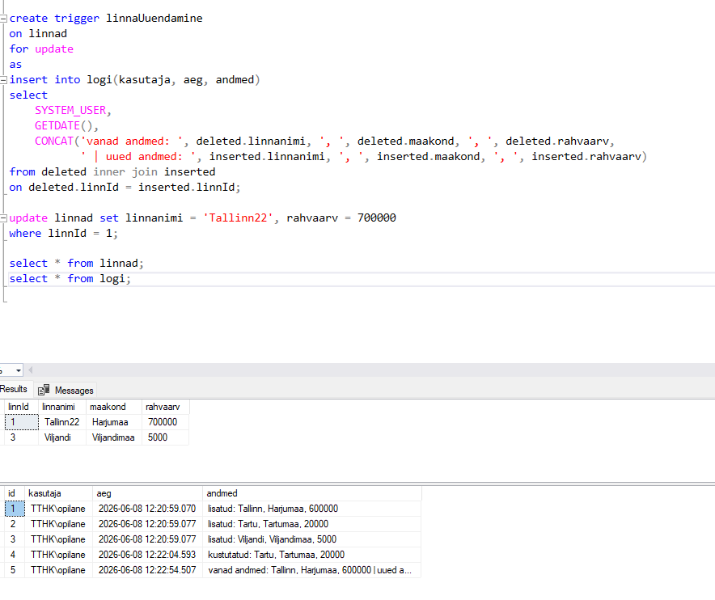
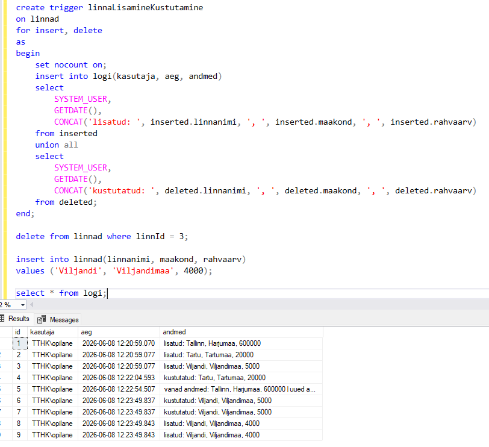
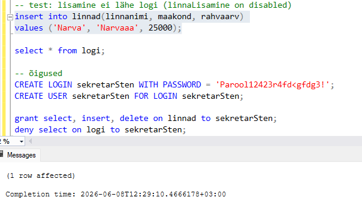

# Andmebaasi võtmed (Keys)

[Põhimõisted](README.md) | [Küsimused](kysimused.md) | [Võtmed](keys.md) | [Triggerid](trigerid.md) | [Triggerite ülesanne](TRIGERIDÜLESANNNEEE.md)

Andmebaasi võtmed on väga olulised andmete korrektuse ja terviklikkuse tagamiseks. Selles dokumendis tutvustame erinevat tüüpi võtmeid ja nende praktilist kasutamist.

---

## 1. Primary Key (Primaarvõti)

### Definitsioon
Primaarvõti on väli või väljadele kombinatsioon, mis uniikselt identifitseerib iga kirjet tabelis. Iga tabelis saab olla ainult üks primaarvõti.

### Kasutus
- Tagab, et iga rida tabelis on kordumatu
- Kiirused andmeotsing
- Viide teiste tabelite välisvõtmete jaoks

### Erinevused teistest võtmetest
- Erinevalt UNIQUE võtmest, primaarvõti ei saa olla NULL
- Ainult üks primaarvõti tabelis
- Automaatselt indekseeritud

### Praktilised näited

```sql
-- Tabeli loomine primaarvõtmega
CREATE TABLE oppilased (
    oppilase_id INT PRIMARY KEY AUTO_INCREMENT,
    eesnimi VARCHAR(50) NOT NULL,
    perekonnanimi VARCHAR(50) NOT NULL,
    e_post VARCHAR(100) UNIQUE
);

-- Andmete sisestamine
INSERT INTO oppilased (eesnimi, perekonnanimi, e_post)
VALUES ('Jaan', 'Jõgi', 'jaan.jogi@email.com');
INSERT INTO oppilased (eesnimi, perekonnanimi, e_post)
VALUES ('Liisa', 'Lehis', 'liisa.lehis@email.com');

-- Andmete pärimine
SELECT * FROM oppilased;
```

---

## 2. Foreign Key (Võõrvõti)

### Definitsioon
Võõrvõti on väli tabelis, mis viitab teise tabeli primaarvõtmele. Luuakse seose kahe tabeli vahel.

### Kasutus
- Referentsiaalse terviklikkuse tagamine
- Andmete loogilisel seostamine
- Korduvandmete vähendamine

### Erinevused teistest võtmetest
- Võib sisaldada NULL väärtusi
- Viiab alati teise tabeli primaarvõtmele
- Võib olla sama tabeli väli (rekursiivne seos)

### Praktilised näited

```sql
-- Kursuste tabel
CREATE TABLE kursused (
    kursuse_id INT PRIMARY KEY AUTO_INCREMENT,
    kursuse_nimi VARCHAR(100) NOT NULL,
    kirjeldus TEXT
);

-- Registreerimised - võõrvõtmega
CREATE TABLE registreerimised (
    registreeringu_id INT PRIMARY KEY AUTO_INCREMENT,
    oppilase_id INT NOT NULL,
    kursuse_id INT NOT NULL,
    registreeringu_kuupaev DATE,
    FOREIGN KEY (oppilase_id) REFERENCES oppilased(oppilase_id),
    FOREIGN KEY (kursuse_id) REFERENCES kursused(kursuse_id)
);

-- Kursuste lisamine
INSERT INTO kursused (kursuse_nimi, kirjeldus)
VALUES ('Andmebaasid', 'SQL ja andmebaasi disain');

INSERT INTO kursused (kursuse_nimi, kirjeldus)
VALUES ('Programmeerimine', 'Python ja Java');

-- Registreerimiste lisamine
INSERT INTO registreerimised (oppilase_id, kursuse_id, registreeringu_kuupaev)
VALUES (1, 1, '2024-01-15');

INSERT INTO registreerimised (oppilase_id, kursuse_id, registreeringu_kuupaev)
VALUES (2, 2, '2024-01-16');

-- Liitpäring - võõrvõtmete kasutamine
SELECT oppilased.eesnimi, oppilased.perekonnanimi, kursused.kursuse_nimi
FROM registreerimised
JOIN oppilased ON registreerimised.oppilase_id = oppilased.oppilase_id
JOIN kursused ON registreerimised.kursuse_id = kursused.kursuse_id;
```

---

## 3. Unique Key (Unikaalne võti)

### Definitsioon
Unikaalne võti tagab, et väli või väljadele kombinatsioon sisaldab ainult kordumatud väärtusi. Erinevalt primaarvõtmest võib sisaldada NULL väärtusi.

### Kasutus
- Väljadele, mis peavad olema kordumatud (nt email, kasutajanimi)
- Primaarvõtmele alternatiiv
- Andmete dublikaatide vältimiseks

### Erinevused teistest võtmetest
- Võib sisaldada NULL väärtusi
- Võib olla rohkem kui üks UNIQUE võti tabelis
- Ei pea olema primaarvõti

### Praktilised näited

```sql
-- Tabel UNIQUE võtmega
CREATE TABLE kasutajad (
    kasutaja_id INT PRIMARY KEY AUTO_INCREMENT,
    kasutajanimi VARCHAR(50) NOT NULL UNIQUE,
    e_post VARCHAR(100) NOT NULL UNIQUE,
    parool VARCHAR(255) NOT NULL
);

-- Andmete sisestamine
INSERT INTO kasutajad (kasutajanimi, e_post, parool)
VALUES ('jaan123', 'jaan@mail.ee', 'salasõna123');

INSERT INTO kasutajad (kasutajanimi, e_post, parool)
VALUES ('liisa456', 'liisa@mail.ee', 'salasõna456');

-- See kutsub välja vea - korduv kasutajanimi
-- INSERT INTO kasutajad (kasutajanimi, e_post, parool)
-- VALUES ('jaan123', 'jaan2@mail.ee', 'salasõna789');

-- Andmete pärimine
SELECT * FROM kasutajad;
```

---

## 4. Simple Key (Lihtne võti)

### Definitsioon
Lihtne võti on üksikust väljast koosnev võti, mis uniikselt identifitseerib kirjeid tabelis.

### Kasutus
- Enamike tabelite primaarvõti
- Lihtne ja kiire andmeotsing
- Seos teiste tabelitega võõrvõtmete kaudu

### Erinevused teistest võtmetest
- Koosneb ainult ühest väljast
- Vastupidiselt komposiitne võtmele, mis koosneb mitmest väljast

### Praktilised näited

```sql
-- Tabel lihtsate võtmetega
CREATE TABLE linnud (
    linde_id INT PRIMARY KEY, -- Lihtne võti
    liigi_nimi VARCHAR(50) NOT NULL,
    värv VARCHAR(30)
);

-- Andmete sisestamine
INSERT INTO linnud (linde_id, liigi_nimi, värv)
VALUES (1, 'Kägu', 'hall');

INSERT INTO linnud (linde_id, liigi_nimi, värv)
VALUES (2, 'Koer-orav', 'punakaspruun');

-- Andmete pärimine
SELECT * FROM linnud WHERE linde_id = 1;
```

---

## 5. Composite Key (Komposiitne võti)

### Definitsioon
Komposiitne võti koosneb kahest või enamast väljast, mille kombinatsioon tagab unikaalsuse. Tavaliselt kasutatakse liistu tabelites.

### Kasutus
- Liistu tabelites (välja näiteks kursuse registreerimine)
- Kui ükskik väli ei ole piisavalt unikaalne
- Seoste modelleerimisel

### Erinevused teistest võtmetest
- Koosneb mitmest väljast
- Vastupidiselt lihtsale võtmele
- Võib sisaldada võõrvõtmeid

### Praktilised näited

```sql
-- Komposiitne võti primaarvõtmena
CREATE TABLE õpetaja_kursused (
    õpetaja_id INT NOT NULL,
    kursuse_id INT NOT NULL,
    semester VARCHAR(20),
    PRIMARY KEY (õpetaja_id, kursuse_id)
);

-- Andmete sisestamine
INSERT INTO õpetaja_kursused (õpetaja_id, kursuse_id, semester)
VALUES (1, 1, '2024/kevad');

INSERT INTO õpetaja_kursused (õpetaja_id, kursuse_id, semester)
VALUES (2, 1, '2024/kevad');

INSERT INTO õpetaja_kursused (õpetaja_id, kursuse_id, semester)
VALUES (1, 2, '2024/sügis');

-- Andmete pärimine
SELECT * FROM õpetaja_kursused;
```

---

## 6. Compound Key (Liit-võti)

### Definitsioon
Liit-võti on mitmest väljast koosnev võti, mis kombineerib mitut andmetüüpi. See on tegelikult sama mis Composite Key ja termini kasutatakse vahel sünonüümina.

### Kasutus
- Keerulisemate seoste modelleerimisel
- Kui on vaja kombineerida erinevate väljadega
- Historiliste andmete jälgimise korral

### Erinevused teistest võtmetest
- Tegelikult samalaadne komposiitne võtmega
- Rõhutab seost erinevate tüüpidega väljadele

### Praktilised näited

```sql
-- Liit-võti - kombinatsioon tehingusse järgarvust ja kuupäevast
CREATE TABLE maksed (
    makseid_id INT PRIMARY KEY AUTO_INCREMENT,
    tehingu_nr VARCHAR(20) NOT NULL,
    kuupaev DATE NOT NULL,
    summa DECIMAL(10,2),
    staatus VARCHAR(20),
    UNIQUE(tehingu_nr, kuupaev)
);

-- Andmete sisestamine
INSERT INTO maksed (tehingu_nr, kuupaev, summa, staatus)
VALUES ('TEH-001', '2024-01-15', 150.00, 'kinnitatud');

INSERT INTO maksed (tehingu_nr, kuupaev, summa, staatus)
VALUES ('TEH-002', '2024-01-15', 200.00, 'ootel');

-- Andmete pärimine
SELECT * FROM maksed;
```

---

## 7. Superkey (Ülivõti)

### Definitsioon
Ülivõti on mis tahes väli või väljadele kombinatsioon, mis uniikselt identifitseerib kirjeid tabelis. Primaarvõti on alati ülivõti, kuid mitte kõik ülivõtmed pole primaarvõtmed.

### Kasutus
- Teoreetiline mõiste andmebaasi disaini juures
- Abil identifitseerida kõik võimalikud võtmed
- Andmebaasi normaalsuse tagamisel

### Erinevused teistest võtmetest
- Laiemalt määratletud kui primaarvõti
- Võib sisaldada "liigse" informatsiooni
- Ei pea olema minimaalne

### Praktilised näited

```sql
-- Näide ülivõtmega
CREATE TABLE kirjandus (
    raamatu_id INT PRIMARY KEY,
    isbn VARCHAR(20) UNIQUE NOT NULL,
    pealkiri VARCHAR(100),
    autor VARCHAR(50),
    ilmumisaasta INT
);

-- Siin on ülivõtmed:
-- - raamatu_id (primaarvõti)
-- - isbn (ainulaadne)
-- - isbn + pealkiri (kombinatsioon)
-- - isbn + pealkiri + autor (kombinatsioon)

-- Andmete sisestamine
INSERT INTO kirjandus (raamatu_id, isbn, pealkiri, autor, ilmumisaasta)
VALUES (1, '978-3-16-148410-0', 'Tarka Oggabi', 'J.R.R. Tolkien', 1954);

INSERT INTO kirjandus (raamatu_id, isbn, pealkiri, autor, ilmumisaasta)
VALUES (2, '978-0-06-112008-4', 'Tüdruk tuules', 'Margaret Mitchell', 1936);

-- Andmete pärimine
SELECT * FROM kirjandus;
```

---

## 8. Candidate Key (Kandidaatvõti)

### Definitsioon
Kandidaatvõti on väli või väljadele kombinatsioon, mis võib olla primaarvõti. Tabelis võib olla mitu kandidaatvõtit, kuid ainult üks valitakse primaarvõtmeks.

### Kasutus
- Andmebaasi disaini etapis kaalutakse erinevaid võimalusi
- Kõik UNIQUE võtmed on potentsiaalsed kandidaatvõtmed
- Disainija valib nende hulgast parima primaarvõtmeks

### Erinevused teistest võtmetest
- Põhineb potentsiaalsusel
- Võib olla mitu tabelis
- Mõningad neist on valitud primaarvõtmeks, teised alt-võtmeteks

### Praktilised näited

```sql
-- Tabel mitme kandidaatvõtmega
CREATE TABLE isikud (
    isiku_id INT PRIMARY KEY, -- Valitud primaarvõti
    ID_kood VARCHAR(20) UNIQUE NOT NULL, -- Kandidaatvõti 1
    e_post VARCHAR(100) UNIQUE NOT NULL, -- Kandidaatvõti 2
    kasutajanimi VARCHAR(50) UNIQUE NOT NULL, -- Kandidaatvõti 3
    eesnimi VARCHAR(50),
    perekonnanimi VARCHAR(50)
);

-- Andmete sisestamine
INSERT INTO isikud (isiku_id, ID_kood, e_post, kasutajanimi, eesnimi, perekonnanimi)
VALUES (1, '38912345678', 'peeter@mail.ee', 'peeter_k', 'Peeter', 'Kapp');

INSERT INTO isikud (isiku_id, ID_kood, e_post, kasutajanimi, eesnimi, perekonnanimi)
VALUES (2, '39023456789', 'kaarina@mail.ee', 'kaarina_l', 'Kaarina', 'Lill');

-- Andmete pärimine kasutades erinevaid kandidaatvõtmeid
SELECT * FROM isikud WHERE isiku_id = 1;
SELECT * FROM isikud WHERE ID_kood = '38912345678';
SELECT * FROM isikud WHERE e_post = 'peeter@mail.ee';
SELECT * FROM isikud WHERE kasutajanimi = 'peeter_k';
```

---

## 9. Alternate Key (Alternatiivvõti)

### Definitsioon
Alternatiivvõti on kandidaatvõti, mis ei ole valitud primaarvõtmeks. Tavaliselt on selle jaoks määratud UNIQUE piirang.

### Kasutus
- Kiire otsing, kasutades UNIQUE indeksi abil
- Alternatiivsed identifikaatorid kirjete otsimiseks
- Kasutajasõbralik otsimine (nt email vs ID-ga otsing)

### Erinevused teistest võtmetest
- Ei ole primaarvõti, kuid on sama tähtis
- UNIQUE piirangud
- Võib sisaldada NULL väärtusi (sõltub implementatsioonist)

### Praktilised näited

```sql
-- Tabel alternatiivvõtmetega
CREATE TABLE toodete_kataloog (
    toode_id INT PRIMARY KEY, -- Primaarvõti
    SKU VARCHAR(50) UNIQUE NOT NULL, -- Alternatiivvõti 1
    bar_kood VARCHAR(50) UNIQUE, -- Alternatiivvõti 2
    toote_nimi VARCHAR(100) NOT NULL,
    kategooria VARCHAR(50),
    hind DECIMAL(10,2)
);

-- Andmete sisestamine
INSERT INTO toodete_kataloog (toode_id, SKU, bar_kood, toote_nimi, kategooria, hind)
VALUES (1, 'SKU-001', '1234567890123', 'Sülearvuti', 'Elektronika', 899.99);

INSERT INTO toodete_kataloog (toode_id, SKU, bar_kood, toote_nimi, kategooria, hind)
VALUES (2, 'SKU-002', '1234567890124', 'Hiir', 'Elektronika', 29.99);

-- Andmete pärimine alternatiivvõtmete kaudu
SELECT * FROM toodete_kataloog WHERE toode_id = 1; -- Otsing primaarvõtte kaudu
SELECT * FROM toodete_kataloog WHERE SKU = 'SKU-001'; -- Otsing alternatiivvõtte kaudu
SELECT * FROM toodete_kataloog WHERE bar_kood = '1234567890124'; -- Otsing bar-koodi kaudu
```

---

## Kokkuvõte

| Võtme tüüp | Kirjeldus | Unikaalsus | NULL väärtused |
|-----------|----------|-----------|-----------------|
| Primary Key | Tabeli peamine identifikaator | Jah | Ei |
| Foreign Key | Viide teise tabeli primaarvõtmele | Ei | Jah |
| Unique Key | Andmete unikaalsus väljal | Jah | Jah |
| Simple Key | Üksikust väljast koosnev võti | Jah | Ei |
| Composite Key | Mitmest väljast koosnev võti | Jah | Ei |
| Compound Key | Liit-võti (samalaadne Composite) | Jah | Ei |
| Superkey | Mis tahes unikaalne kombinatsioon | Jah | Ei |
| Candidate Key | Potentsiaalne primaarvõti | Jah | Sõltub |
| Alternate Key | Primaarvõti alternatiiv | Jah | Jah |

---

## Triggerid (Triggers)

### 💡 Trigerite loomine SQL Server / XAMPP

SQL triggerid on spetsiaalsed andmebaasi objektid, mis käivituvad automaatselt, kui toimub teatud sündmus (nt INSERT, UPDATE või DELETE). Triggerite loomine aitab automatiseerida protsesse, tagada andmete terviklikkust ja rakendada äri loogikat otse andmebaasis.

---

### SQL Server - Triggerite näited

#### Andmebaasi ja tabelite loomine

```sql
CREATE DATABASE trigerLogitpe24;
USE trigerLogitpe24;

CREATE TABLE linnad(
    linnID INT PRIMARY KEY IDENTITY (1,1),
    linnanimi VARCHAR(50) NOT NULL,
    rahvaarv INT
);

CREATE TABLE logi(
    id INT PRIMARY KEY IDENTITY (1,1),
    kasutaja VARCHAR(100),
    aeg DATETIME,
    toiming VARCHAR(100),
    andmed TEXT
);
```

---

#### INSERT Trigger - Lisatud kirjeid jälgimiseks

Jälgib andmete sisestamist tabelis "linnad" ja teeb vastava kirje tabelis "logi".

```sql
CREATE TRIGGER linnaLisamine
ON linnad
FOR INSERT
AS
INSERT INTO logi(aeg, toiming, andmed)
SELECT
    GETDATE(),
    'on tehtud INSERT käsk',
    inserted.linnanimi
FROM inserted;
```

**Trigeri tegevuse kontroll:**

```sql
INSERT INTO linnad(linnanimi, rahvaarv)
VALUES ('Tallinn', 600000);

SELECT * FROM linnad;
SELECT * FROM logi;
```

---

#### ALTER TRIGGER - Trigeri muutmine

Leiame vajaliku tabeli andmebaasis → Avame Triggers kausta → Paremklõpsame soovitud triggeril → Valime Modify (Muuda).

```sql
USE [trigerLogitpe24]
GO

ALTER TRIGGER [dbo].[linnaLisamine]
ON [dbo].[linnad]
FOR INSERT
AS
INSERT INTO logi(aeg, toiming, andmed)
SELECT
    GETDATE(),
    'on tehtud INSERT käsk',
    CONCAT('linn: ', inserted.linnanimi, ', elanike arv: ', inserted.rahvaarv)
FROM inserted;
```

**Tõsta esile ALTER TRIGGER → Execute → Käsk täidetud**

---

#### Kasutaja lisamine logi tabelisse

Tools → Options → Designers → Table and Database Designers → Eemaldada linnuke valikust "Prevent saving changes that require table re-creation"

Lisame välja "kasutaja" tabelisse ja salvestame:

```sql
ALTER TRIGGER [dbo].[linnaLisamine]
ON [dbo].[linnad]
FOR INSERT
AS
INSERT INTO logi(kasutaja, aeg, toiming, andmed)
SELECT
    SUSER_NAME(),
    GETDATE(),
    'on tehtud INSERT käsk',
    CONCAT('linn: ', inserted.linnanimi, ', elanike arv: ', inserted.rahvaarv)
FROM inserted;
```

**SUSER_NAME** on SQL funktsioon, mis tagastab hetkel sisse logitud kasutaja nime.

---

#### DELETE Trigger - Kustutatud kirjeid jälgimiseks

```sql
CREATE TRIGGER linnaKustutamine
ON linnad
FOR DELETE
AS
INSERT INTO logi(kasutaja, aeg, toiming, andmed)
SELECT
    SUSER_NAME(),
    GETDATE(),
    'on tehtud DELETE käsk',
    CONCAT('linn: ', deleted.linnanimi, ', elanike arv: ', deleted.rahvaarv)
FROM deleted;
```

**Kontrollimine:**

```sql
DELETE FROM linnad
WHERE linnID=1;

SELECT * FROM linnad;
SELECT * FROM logi;
```

---

#### UPDATE Trigger - Muudetud kirjeid jälgimiseks

```sql
CREATE TRIGGER linnaUuendamine
ON linnad
FOR UPDATE
AS
INSERT INTO logi(kasutaja, aeg, toiming, andmed)
SELECT
    SUSER_NAME(),
    GETDATE(),
    'on tehtud UPDATE käsk',
    CONCAT('vanad andmed - linn: ', deleted.linnanimi,
    ', elanike arv: ', deleted.rahvaarv,
    ' | uued andmed - linn: ', inserted.linnanimi,
    ', elanike arv: ', inserted.rahvaarv)
FROM deleted
INNER JOIN inserted
ON deleted.linnID=inserted.linnID;
```

---

#### Kombineerime INSERT ja DELETE triggerid

See SQL trigger salvestab logi iga kord, kui linnade tabelis lisatakse uus linn või kustutatakse olemasolev linn. Trigger käivitub pärast INSERT või DELETE toimingut ja salvestab logisse andmed.

```sql
--INSERT, DELETE Trigger
CREATE TRIGGER linnaLisamineJaKustutamine
ON linnad
FOR INSERT, DELETE
AS
BEGIN
    SET NOCOUNT ON;
    
    INSERT INTO logi(kuupaev, andmed, kasutaja)
    SELECT
        getdate(),
        CONCAT('lisatud linn: ', inserted.linnanimi,
        ' | rahvaarv: ', inserted.rahvaarv, ' | id: ', inserted.linnID),
        SYSTEM_USER
    FROM inserted
    
    UNION ALL
    
    SELECT
        getdate(),
        CONCAT('kustutatud linn: ', deleted.linnanimi,
        ' | rahvaarv: ', deleted.rahvaarv, ' | id: ', deleted.linnID),
        SYSTEM_USER
    FROM deleted;
END;

--Deaktiveerime linnaLisamine ja linnaKustutamine
DISABLE TRIGGER linnaLisamine ON linnad;
DISABLE TRIGGER linnaKustutamine ON linnad;
```

---

### XAMPP/MariaDB - Triggerite näited

#### Andmebaasi ja tabelite loomine

```sql
create database trigerLogitpe24;
use trigerLogitpe24;

create table linnad(
    linnId int primary key identity(1,1),
    linnanimi varchar(30) unique,
    maakond varchar(50),
    rahvaarv int
);

create table logi(
    id int primary key identity(1,1),
    kasutaja varchar(50),
    aeg DATETIME,
    andmed TEXT
);
select * from linnad;
select * from logi;


```

#### INSERT Trigger - XAMPP/MariaDB

```sql
create trigger linnaLisamine
on linnad
for insert
as
insert into logi(kasutaja, aeg, andmed)
select
    SYSTEM_USER,
    GETDATE(),
    CONCAT('lisatud: ', inserted.linnanimi, ', ', inserted.maakond, ', ', inserted.rahvaarv)
from inserted;

insert into linnad(linnanimi, maakond, rahvaarv)
values ('Tallinn', 'Harjumaa', 600000);

insert into linnad(linnanimi, maakond, rahvaarv)
values ('Tartu', 'Tartumaa', 20000);

insert into linnad(linnanimi, maakond, rahvaarv)
values ('Viljandi', 'Viljandimaa', 5000);

select * from linnad;
select * from logi;
```

#### DELETE Trigger - XAMPP/MariaDB

```sql
create trigger linnaKustutamine
on linnad
for delete
as
insert into logi(kasutaja, aeg, andmed)
select
    SYSTEM_USER,
    GETDATE(),
    CONCAT('kustutatud: ', deleted.linnanimi, ', ', deleted.maakond, ', ', deleted.rahvaarv)
from deleted;

delete from linnad where linnId = 2;

select * from linnad;
select * from logi;


```

#### UPDATE Trigger - XAMPP/MariaDB

```sql
create trigger linnaUuendamine
on linnad
for update
as
insert into logi(kasutaja, aeg, andmed)
select
    SYSTEM_USER,
    GETDATE(),
    CONCAT('vanad andmed: ', deleted.linnanimi, ', ', deleted.maakond, ', ', deleted.rahvaarv,
           ' | uued andmed: ', inserted.linnanimi, ', ', inserted.maakond, ', ', inserted.rahvaarv)
from deleted inner join inserted
on deleted.linnId = inserted.linnId;

update linnad set linnanimi = 'Tallinn22', rahvaarv = 700000
where linnId = 1;

select * from linnad;
select * from logi;


```
#### linnaLisamineKustutamine
create trigger linnaLisamineKustutamine
on linnad
for insert, delete
as
begin
    set nocount on;
    insert into logi(kasutaja, aeg, andmed)
    select
        SYSTEM_USER,
        GETDATE(),
        CONCAT('lisatud: ', inserted.linnanimi, ', ', inserted.maakond, ', ', inserted.rahvaarv)
    from inserted
    union all
    select
        SYSTEM_USER,
        GETDATE(),
        CONCAT('kustutatud: ', deleted.linnanimi, ', ', deleted.maakond, ', ', deleted.rahvaarv)
    from deleted;
end;

delete from linnad where linnId = 3;

insert into linnad(linnanimi, maakond, rahvaarv)
values ('Viljandi', 'Viljandimaa', 4000);
select * from logi;


---
## Triggerite keelamine
disable trigger linnaLisamine on linnad;
disable trigger linnaKustutamine on linnad;
enable trigger linnaUuendamine on linnad;

-- test: lisamine ei lähe logi (linnaLisamine on disabled)
insert into linnad(linnanimi, maakond, rahvaarv)
values ('Narxva', 'Narvaaa', 25000);

select * from logi;

-- õigused
CREATE LOGIN sekretarSten WITH PASSWORD = 'Parool12423r4fd<gfdg3!';
CREATE USER sekretarSten FOR LOGIN sekretarSten;

grant select, insert, delete on linnad to sekretarSten;
deny select on logi to sekretarSten;



----

## Andmebaaside põhimõisted - Kiirkokkuvõte

**Andmebaasistruktuur:**
- Andmebaas - Andmebaasihaldussüsteem (DBMS) - Tabel - Veerg (atribuut) - Rida (kirje)

**Võtmed ja piirangud:**
- Primaarvõti (Primary Key) - Võõrvõti (Foreign Key) - Indeks - Piirangud (Constraints)

**Päringud ja operatsioonid:**
- Päring (SELECT) - Tingimus (WHERE) - Sorteerimine (ORDER BY) - Grupeerimine (GROUP BY) - Liitmine (JOIN)

**Andmebaasi objektid:**
- Vaade (VIEW) - Protseduur (Stored Procedure) - Trigger - Skeem

**Andmetüübid:**
- INT, SMALLINT, DECIMAL, FLOAT - CHAR, VARCHAR, TEXT - DATE, TIME, DATETIME - BOOLEAN

**Muud mõisted:**
- NULL väärtus - Relatsioon - Kasutaja ja õigused (GRANT, REVOKE)

